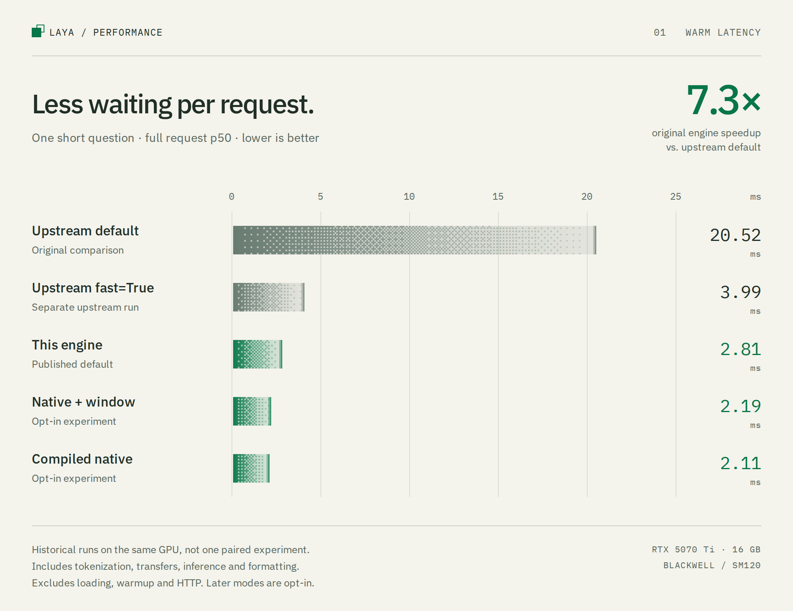
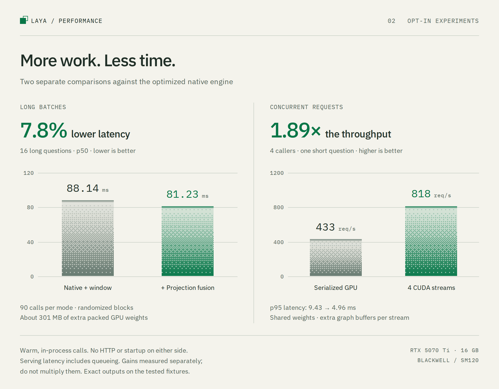
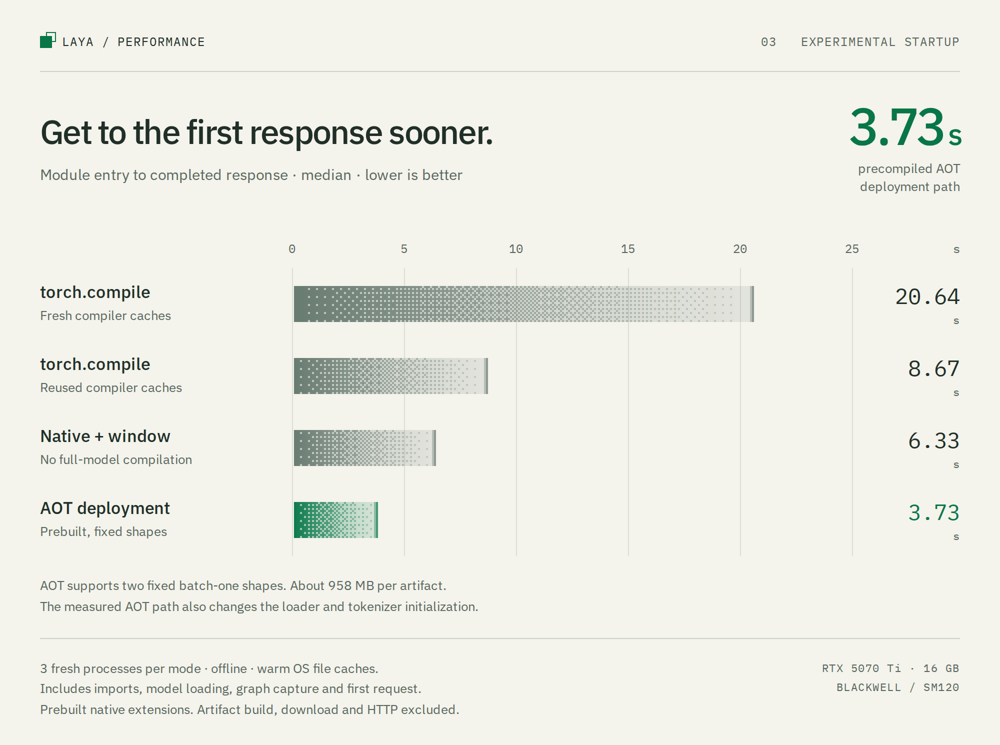

# Laya Inference Engine

A GPU inference engine for [Laya](https://huggingface.co/convaiinnovations/laya), tested on the NVIDIA RTX 5070 Ti. It keeps weights on the GPU and uses BF16, CUDA Graphs, and a fused RoPE kernel to reduce request latency. CPU code handles tokenization and response formatting.

Laya returns typed decisions in one forward pass. Useful metrics are completed-request latency, decisions per second, and input tokens per second. It does not generate or stream text.

Contributor model to this effort and testing: GPT-6 Astra.

<picture>
  <source media="(prefers-color-scheme: dark)" srcset="docs/assets/warm-latency-dark.png">
  <source media="(prefers-color-scheme: light)" srcset="docs/assets/warm-latency-light.png">
  
</picture>

[Measurement details](#performance) · [All benchmark results](results/README.md) · [Balanced and fast configurations](docs/performance-modes.md)

## Quickstart

Use Linux, Python 3.12, [uv](https://docs.astral.sh/uv/), and a Blackwell GPU with a CUDA 13.2-compatible driver. The tested device has 16 GB VRAM and driver 595.84. `uv.lock` pins PyTorch 2.14.0+cu132, Triton 3.8.0, Transformers 5.17.0, and Laya 0.3.9.

```bash
uv sync --locked
uv run laya-blackwell info
uv run laya-blackwell predict --request examples/request.json
```

The first call downloads the checkpoint and initializes the GPU kernels. Each CLI invocation starts a new process. Keep the Python engine or HTTP server running to reuse weights and captured graphs.

The default checkpoint is the root English model at revision [`5e7b2b1b8ca2ecdd3f2322d94069c9b6ce7e844b`](https://huggingface.co/convaiinnovations/laya/tree/5e7b2b1b8ca2ecdd3f2322d94069c9b6ce7e844b). Its 512-token limit includes question formatting. Other checkpoint variants and other Blackwell GPUs have not been validated.

## Python

```python
from laya_blackwell import BlackwellEngine

state = "I was billed twice. Please refund the duplicate charge."
questions = {
    "refund_requested": {
        "type": "noul",
        "instructions": "Does the customer request a refund?",
    },
}

with BlackwellEngine(device="cuda:0") as engine:
    engine.warmup(state, questions)
    result = engine.predict(state, questions)
    print(result["answers"])
```

Questions support `choice`, `score`, and `noul`. Request formatting and temperature scaling follow the Laya SDK. `system_one` is an alias for `predict`. See [examples/request.json](examples/request.json) for a complete request.

The engine defaults to at most 64 questions per request and eight cached configurations of batch size, sequence length, option count, and attention mask mode. Padded and fully occupied sequences use separate graphs. An unseen or evicted configuration requires graph capture. Warm representative requests for steady-state latency; responses report graph misses and setup time in `result["engine"]`.

## HTTP server

```bash
uv run laya-blackwell serve --host 127.0.0.1 --port 8000
```

```bash
curl http://127.0.0.1:8000/v1/systemone \
  -H 'Content-Type: application/json' \
  --data-binary @examples/request.json
```

The server warms representative requests at startup. It binds to localhost by default. Set `LAYA_API_KEY` or pass `--api-key` to require `Authorization: Bearer ...` for inference; `/health` stays public.

One engine serializes GPU access to protect reusable buffers. Separate HTTP requests are not dynamically batched. Each engine uses one GPU; use `--device cuda:1` or the Python `device` argument for another GPU. There is no cross-GPU scheduler.

## Performance

On the same RTX 5070 Ti, the recorded BF16 run measured **2.81 ms p50** for a warm single short-question request. Default upstream took **20.52 ms**, while its optional **`fast=True` mode took 3.99 ms**. This engine was about 7.3× faster than default upstream and 1.4× faster than upstream fast mode on that case. [Default comparison](results/benchmark.json), [upstream fast mode](results/upstream-fast.json)

Compared with upstream fast mode, sixteen short questions were about 1.3× faster and sixteen long questions were about 1.1× faster. A single long question was roughly tied. These runs were sequential. A [response check](results/validation-upstream-fast.json) matched all 43 top decisions in the timed workloads; upstream fast mode failed a separate single-option request.

Upstream `compile=True` measured 8.24 ms for one short question, slower than its fast mode. [Compile-mode results](results/upstream-compile.json)

All paths include tokenization, transfers, inference, and formatting. **All exclude startup and HTTP overhead.** These are serial in-process measurements, with five warmups and 100 timed requests per case for the default comparison and 50 for upstream fast mode.

First-use setup is a separate tradeoff. In a matched test on **an RTX A6000**, this engine's first short request took **0.40 seconds after model loading**, versus **36.7 seconds** for the comparison project's optimized FP16 GPU implementation with `torch.compile` and CUDA Graphs. Warm requests favored that compiled implementation: 2.57 ms versus 3.57 ms here. These first-call figures include shape setup and graph capture, plus compilation where enabled; they exclude model loading and download and are not clean-machine cold starts. This engine ran on Ampere through a benchmark-only hardware-check override. These are A6000 results, not Blackwell startup measurements. [This engine's raw run](results/rtx-a6000/blackwell.json), [compiled GPU raw run](results/rtx-a6000/gpu-compiled.json)

The experiments also provide [balanced and fast configuration recipes](docs/performance-modes.md).
They document extra GPU memory, setup costs and which workloads benefit. The
[results index](results/README.md) separates warm latency, startup, concurrent
serving and hardware comparisons.

<picture>
  <source media="(prefers-color-scheme: dark)" srcset="docs/assets/experimental-gains-dark.png">
  <source media="(prefers-color-scheme: light)" srcset="docs/assets/experimental-gains-light.png">
  
</picture>

These gains use more GPU memory for packed weights or independent graph buffers.
They are separate experiments; their speedups cannot be multiplied.
[Fusion measurements](results/latency-optimizations/fusion/best.json),
[concurrent serving measurements](results/latency-optimizations/serving/confirmation-summary.json)

<picture>
  <source media="(prefers-color-scheme: dark)" srcset="docs/assets/startup-dark.png">
  <source media="(prefers-color-scheme: light)" srcset="docs/assets/startup-light.png">
  
</picture>

The AOT path includes loader and tokenizer changes and supports two fixed
batch-one shapes. Each prebuilt artifact is about 958 MB. These startup timings
include imports and model loading, unlike the after-loading A6000 comparison
above. [Startup matrix](results/latency-optimizations/aot/final-offline/matrix-summary.json),
[AOT scope and reproduction](experiments/latency/aot/README.md)

The charts use [Dither Kit](https://www.tripwire.sh/dither-kit) and read the
committed benchmark files directly. [Regenerate the images](docs/charts/README.md).

A separate [localhost HTTP comparison](results/benchmark-http.json) uses the same server wrapper and client for each backend. One short question took 3.99 ms here, 5.05 ms with upstream fast mode, and 22.52 ms with default upstream. All three exclude model and server startup equally.

This comparison measures software improvements on Blackwell. It does not measure Blackwell's advantage over an older GPU. CUDA Graphs, resident BF16 weights, and most default kernels are not Blackwell-exclusive. The [performance documentation](docs/performance.md) explains the kernel evidence, measurement boundaries, and reproduction commands.

A controlled [graph ablation](results/ablation.json) measured 20.30 ms for default upstream, 11.39 ms for this engine without graph replay, and 2.81 ms with replay on one short question. Graph replay accounted for about 49% of that measured latency reduction, conditional on the other optimizations. Its benefit was small for sixteen short questions and within noise for sixteen long questions.

The BF16 regression matched all 80 selected decisions across 34 synthetic requests. Maximum probability error against equally padded upstream inputs was 0.002761. Preprocessing matches upstream, including long conversation lists. Padding itself can change probabilities, and these checks do not establish task accuracy or calibration. [Validation results](results/validation.json)

`--backend fp8` is experimental. It uses native SM120 FP8 GEMMs but fails decision parity on the bundled regression. The default remains `fused`, the validated BF16 path. `eager` is available for diagnosis.

## Development

```bash
uv sync --extra dev --locked
uv run pytest -q -m 'not gpu'
LAYA_RUN_MODEL_TESTS=1 uv run pytest -q
```

The full GPU suite checks numerical kernels, graph replay with changing inputs, cache eviction, and concurrent callers. The checkpoint tests require a Blackwell GPU and the downloaded model.

- [src/laya_blackwell](src/laya_blackwell) contains the engine, model, kernels, request protocol, and serving code.
- [tests](tests) contains CPU and GPU regression tests.
- [scripts](scripts) contains graph ablation, HTTP benchmarking, and optional upstream-mode probes.
- [results](results) retains benchmark samples and validation evidence. Large profiler traces and local caches are not needed to run the package.

Original code and modifications use the [MIT license](LICENSE). Upstream-derived portions retain their [Apache-2.0 terms](licenses/Apache-2.0.txt) and attribution in [NOTICE](NOTICE). Package metadata records `MIT AND Apache-2.0` to reflect both. Laya's model and SDK are developed by [Convai Innovations](https://huggingface.co/convaiinnovations/laya) and distributed under Apache-2.0. Model weights download separately and are not bundled here.
