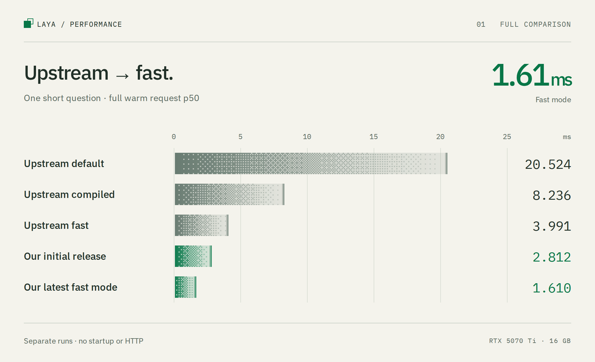
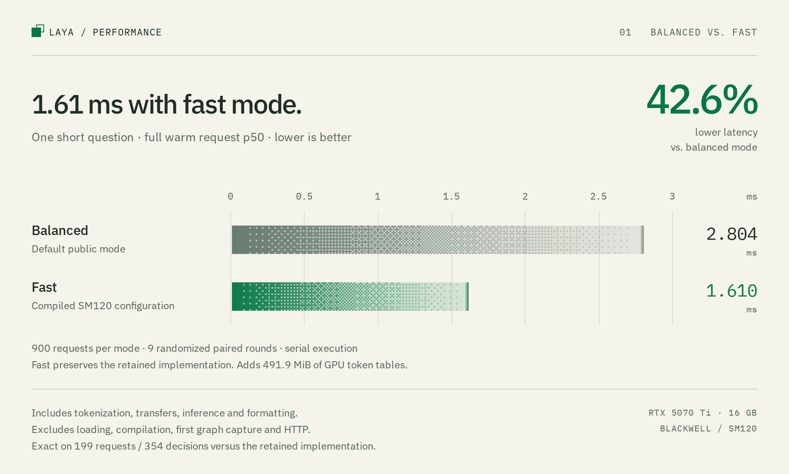

# Laya Inference Engine

A GPU inference engine for [Laya](https://huggingface.co/convaiinnovations/laya), tested on the NVIDIA RTX 5070 Ti. Choose the default **balanced** mode for simpler setup, or **fast** mode for compiled SM120 kernels and lower warm latency.

Fast mode measured **1.61 ms** for a complete warm short-question request,
**42.6% lower latency** than balanced mode in the same paired comparison. This
includes tokenization, transfers, inference and response formatting. It uses
491.9 MiB of extra GPU token tables and needs compilation and first-use setup.
Sub-millisecond full requests were not achieved.

Laya returns typed decisions in one forward pass. It does not generate or stream text; completed-request latency and decisions per second describe its performance.

Contributor model to this effort and testing: GPT-6 Astra.

<picture>
  <source media="(prefers-color-scheme: dark)" srcset="docs/assets/performance-overview-dark.png">
  <source media="(prefers-color-scheme: light)" srcset="docs/assets/performance-overview-light.png">
  
</picture>

[Mode selection and build options](docs/performance-modes.md) · [All benchmark results](results/README.md) · [Measurement and hardware details](docs/performance.md)

[How the optimizations work](#how-the-optimizations-work) · [Further optimization scope](#further-optimization-scope)

## Quickstart

Use Linux, Python 3.12, [uv](https://docs.astral.sh/uv/), and a Blackwell GPU with a CUDA 13.2-compatible driver. The tested RTX 5070 Ti has 16 GB VRAM and driver 595.84. The lockfile pins PyTorch 2.14.0+cu132, Triton 3.8.0, Transformers 5.17.0, NumPy 2.5.3 and Laya 0.3.9.

Balanced mode needs no separate native-extension build:

```bash
uv sync --locked
uv run laya-blackwell info
uv run laya-blackwell predict --request examples/request.json
```

Fast mode also needs a CUDA toolkit with `nvcc` and a C++ compiler. The validated toolkit is CUDA 13.1:

```bash
uv sync --extra fast --locked
uv run laya-blackwell build-fast
uv run laya-blackwell predict --mode fast --request examples/request.json
```

Fast mode targets SM120 and the pinned root English checkpoint. It adds **491.9 MiB of GPU token tables**, native extensions and compilation for the short request shape. First use includes table preparation, compilation and graph capture. Other Blackwell GPUs and checkpoint variants have not been validated. See [requirements and build options](docs/performance-modes.md).

The checkpoint revision is [`5e7b2b1b8ca2ecdd3f2322d94069c9b6ce7e844b`](https://huggingface.co/convaiinnovations/laya/tree/5e7b2b1b8ca2ecdd3f2322d94069c9b6ce7e844b). Its 512-token limit includes question formatting. The first run downloads the weights. Keep an engine or server process running to reuse weights and captured graphs; every CLI invocation starts a new process.

## Python

```python
from laya_blackwell import create_engine

state = "I was billed twice. Please refund the duplicate charge."
questions = {
    "refund_requested": {
        "type": "noul",
        "instructions": "Does the customer request a refund?",
    },
}

with create_engine(mode="fast", device="cuda:0") as engine:
    engine.warmup(state, questions)
    print(engine.predict(state, questions)["answers"])
```

Use `mode="balanced"` for the default path. `BlackwellEngine` and `FastEngine` are also available as direct imports. Questions support `choice`, `score`, and `noul`; `system_one` is an alias for `predict`. See [examples/request.json](examples/request.json).

Warm representative requests before measuring latency. The engines cache up to eight graph configurations by default and allow up to 64 questions per request. An unseen or evicted shape needs setup again. Responses expose timing and graph-cache information in `result["engine"]`.

## HTTP server

```bash
uv run laya-blackwell serve --mode fast --host 127.0.0.1 --port 8000
```

```bash
curl http://127.0.0.1:8000/v1/systemone \
  -H 'Content-Type: application/json' \
  --data-binary @examples/request.json
```

Omit `--mode fast` to serve balanced mode. The server warms representative requests at startup and binds to localhost by default. Set `LAYA_API_KEY` or pass `--api-key` to require bearer authentication for inference; `/health` stays public.

Each engine serializes GPU access and uses one GPU. Separate HTTP requests are not dynamically batched. Select another GPU with `--device cuda:1` or the Python `device` argument.

## Performance

The public-mode comparison uses 900 full requests per mode across nine
randomized paired rounds on the same RTX 5070 Ti:

| Workload | Balanced | Fast | Latency reduction |
| --- | ---: | ---: | ---: |
| One short question | 2.804 ms | 1.610 ms | 42.6% |
| One long question | 8.616 ms | 6.968 ms | 19.1% |
| Sixteen short questions | 12.591 ms | 10.553 ms | 16.2% |

These are warm serial p50 measurements. They include tokenization, host packing,
transfers, inference, synchronization and formatting; they exclude model loading,
compilation, first capture and HTTP. With 128 changing short inputs repeated over
nine rounds, fast measured 1.636 ms versus 2.784 ms balanced.
[Raw samples and validation](results/fast-package.json)

Packaging preserved the retained implementation's performance, which measured
1.612 ms beside fast mode's 1.610 ms in this run. The small difference does not
establish an extra optimization win. Fast matched the retained implementation's
prepared inputs, raw choice/action logits and public responses, excluding runtime
metrics, on **199 requests with 354 decisions**. Another 52 concurrent calls matched, and graph eviction,
output ownership and close behavior passed checks. These are synthetic
implementation-parity checks, not evidence of task accuracy or calibration.

Before packaging, the retained implementation measured 1.624 ms against an
earlier native baseline at 2.197 ms, a 26.1% reduction. That native baseline was
not balanced mode. This earlier comparison remains in the
[optimization archive](results/frontier/summary.json).

The original balanced implementation measured 2.81 ms against default upstream at 20.52 ms, about 7.3× faster. Upstream's optional `Agent(fast=True)` measured 3.99 ms in a separate run. **Upstream `fast=True` is the Laya SDK's mode; this repository's `--mode fast` is a different implementation.** Those older results are historical comparisons, and their ratios must not be multiplied with the latest paired reduction.

<picture>
  <source media="(prefers-color-scheme: dark)" srcset="docs/assets/public-modes-dark.png">
  <source media="(prefers-color-scheme: light)" srcset="docs/assets/public-modes-light.png">
  
</picture>

[Original comparison](results/benchmark.json), [upstream fast mode](results/upstream-fast.json), [matched HTTP comparison](results/benchmark-http.json). Both sides exclude startup equally in these warm comparisons. This measures software improvements on Blackwell; it does not assign a percentage of the gain to Blackwell hardware itself.

First-use setup has a different scope. On an **RTX A6000**, the older engine's first short request took **0.40 seconds after model loading**, versus **36.7 seconds** for a separate optimized FP16 GPU implementation with `torch.compile` and CUDA Graphs. Warm requests favored that implementation, 2.57 ms versus 3.57 ms here. These figures include first-shape setup and exclude loading and download. They do not measure FastEngine startup or Blackwell startup. [Matched A6000 comparison](docs/rtx-a6000-comparison.md)

Separate [fusion, concurrent serving and AOT deployment experiments](docs/performance-modes.md#separate-research-results) have different memory and setup tradeoffs. They are not combined into fast mode. The charts use [Dither Kit](https://www.tripwire.sh/dither-kit) and read recorded samples directly. [Regenerate the images](docs/charts/README.md).

## How the optimizations work

Each request turns text into tokens, runs the model on the GPU, then formats
the decisions on the CPU. We optimized all three stages. The initial release
established the balanced path; fast mode keeps that foundation and specializes
more of the work for short requests.

| Optimization | What it does |
| --- | --- |
| Resident weights and CUDA Graphs | Keep matrix weights in 16-bit BF16 form and reuse GPU buffers. Record the GPU operations once per shape, then replay them. This avoids repeated conversion, allocation and Python dispatch. Both modes use this. |
| Less work in the decision head | Compute the final head's queries and feed-forward outputs only at the decision and option-token positions. Keys and values still cover the full input, so those outputs retain access to the context. Both modes use this. |
| Fused GPU kernels | Fast mode combines operations such as a feed-forward projection with its activation, or a reduction with residual addition and normalization. Fewer kernels mean fewer launches and less temporary data written to GPU memory. |
| Kernels tuned for short requests | Fast mode selects matrix tile sizes, attention blocks and load schedules for the 64-token, single-question shape. Selected projections use the Tensor Memory Accelerator, or TMA, for bulk tensor loads. This shape also uses `torch.compile`; larger shapes keep native execution. |
| Precomputed token tables | Fast mode stores normalized embeddings and the first query/key/value projection for every token. These depend only on the token and frozen weights, before positional encoding and attention. The tables cost 491.9 MiB; each request still computes its context-dependent predictions. |
| Native CPU work | Fast mode batches tokenization through the Rust tokenizer and uses C++ for input packing, graph replay and response formatting. This reduces Python work around the GPU call. |

Fast mode keeps BF16 matrix arithmetic and preserves the reference's tested
intermediate rounding, attention masks and output formatting. Its exact-output
checks cover the fixtures described above, not every possible input. The
configuration is tuned for SM120; CUDA Graphs, fusion and BF16 are useful on
other architectures too. [Implementation](src/laya_blackwell/fast),
[experiment details](experiments/frontier/README.md)

## Further optimization scope

The remaining work has several different goals:

| Goal | What could improve next |
| --- | --- |
| Lower single-request latency | Reduce GPU memory traffic and scheduling overhead while preserving rounding. Existing profiles put most time on the GPU, so rewriting more Python in C++ or Rust alone has limited headroom. |
| Faster long inputs and batches | Extend shape-specific kernel tuning beyond the short request. The current fast mode improves these workloads too, but many of its specializations apply only to the 64-token shape. |
| More concurrent requests | Integrate and validate multiple CUDA streams with `FastEngine`. A separate four-stream prototype improved concurrent throughput; the public engine currently serializes GPU access. Request batching is another candidate, with a queueing-latency tradeoff. |
| Less first-use setup | Adapt the separate ahead-of-time compilation prototype and investigate saving token tables during an offline build. This would target startup and cold shapes; warm request latency is a separate measurement. |
| Lower precision | FP8 and FP4 reduce data size and can accelerate matrix work, but our tested variants changed decisions. An approximate mode would need broader task-quality evaluation and potentially calibration or quantization-aware training before adoption. |

Follow-up tests of weight repacking, bulk prefetch and mapped-memory I/O did
not deliver a consistent full-request win on the short target. Additional
fusion and lossless compression also showed that fewer kernels or fewer stored
bytes can still be slower. Future changes need to improve the complete
request, including CPU work, and pass the relevant numerical checks.
[Recorded experiments](experiments/frontier/README.md),
[throughput and startup prototypes](docs/performance-modes.md#separate-research-results)

## Development

```bash
uv sync --extra dev --extra fast --locked
uv run pytest -q -m 'not gpu'
LAYA_RUN_MODEL_TESTS=1 LAYA_RUN_FAST_TESTS=1 uv run pytest -q
```

[src/laya_blackwell](src/laya_blackwell) contains the public engines, kernels and server. The retained fast runtime lives in [src/laya_blackwell/fast](src/laya_blackwell/fast). [experiments](experiments) and [results](results) retain research and benchmark evidence; the public runtime does not import experimental implementations. GPU tests require the downloaded model and supported hardware.

The full test run passed 110 tests, including all eight GPU tests. Reproduce the
paired package checks with `uv run python -m scripts.validate_fast_package`.
The [performance guide](docs/performance.md#dependencies-and-reproduction)
also covers sequential public-mode benchmarking and installed-wheel validation
with `scripts.validate_wheel`. [Package checks](results/package-checks.json)

Original code and modifications use the [MIT license](LICENSE). Upstream-derived portions retain their [Apache-2.0 terms](licenses/Apache-2.0.txt), and native kernels retain their [BSD-3-Clause licenses and attribution](src/laya_blackwell/fast/native/NOTICE.txt). Package metadata records `MIT AND Apache-2.0 AND BSD-3-Clause`; see [NOTICE](NOTICE). Laya's model and SDK are developed by [Convai Innovations](https://huggingface.co/convaiinnovations/laya) and distributed under Apache-2.0. Model weights download separately and are not bundled here.
