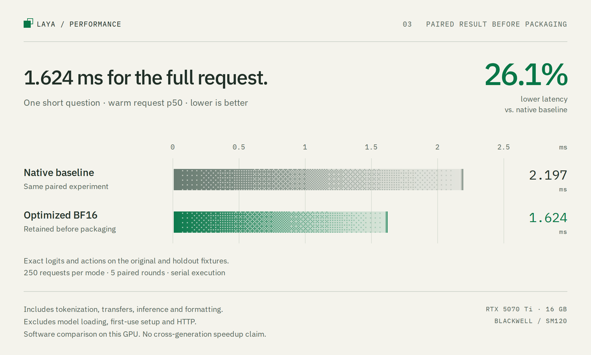

# Performance and hardware

The benchmark measures Laya's completed decisions. Laya is a non-autoregressive model, so generated-token throughput and streaming TTFT do not describe this workload.

## Public balanced and fast modes

The [package validation](../results/fast-package.json) compares balanced mode,
the public `FastEngine` and its retained research implementation with all three
resident on the same RTX 5070 Ti. Each fixed workload has 900 measurements per
mode from nine randomized paired rounds of 100 calls.

| Workload | Balanced p50 | Fast p50 | Retained p50 | Fast reduction vs. balanced |
| --- | ---: | ---: | ---: | ---: |
| One short question | 2.803832 ms | 1.610069 ms | 1.611524 ms | 42.6% |
| One long question | 8.615601 ms | 6.967680 ms | 6.972121 ms | 19.1% |
| Sixteen short questions | 12.590964 ms | 10.553087 ms | 10.554782 ms | 16.2% |

All modes use full serial `predict` calls, including tokenization, transfers,
inference, synchronization and formatting. Loading, compilation, first graph
capture and HTTP are excluded equally. The short fixture has 64 input tokens,
one question and four options. Sub-millisecond full requests were not achieved.

Packaging effectively ties the retained implementation. The small differences
between them do not establish another optimization gain. A separate changing-input
case cycles 128 short fixtures over nine rounds, giving 1,152 samples per mode.
Its p50 is 2.783642 ms balanced, 1.635720 ms fast and 1.643380 ms retained.

The extracted runtime matched prepared inputs, bitwise choice/action logits and
public responses, excluding runtime metrics, on 199 requests with 354 decisions.
Checks also passed for 52 concurrent calls, owned output buffers, graph eviction,
resource release, repeated close and rejecting requests after close. Source and
native-library hashes stayed unchanged during the experiment. This verifies
the extraction against the retained implementation; it is not labeled task
accuracy or a guarantee for every possible input.

The public mode trades additional preparation and 491.9 MiB of token tables for
lower warm latency. [Setup and operating details](performance-modes.md)

## Retained implementation before packaging

<picture>
  <source media="(prefers-color-scheme: dark)" srcset="assets/latest-paired-dark.png">
  <source media="(prefers-color-scheme: light)" srcset="assets/latest-paired-light.png">
  
</picture>

The [pre-extraction paired comparison](../results/frontier/summary.json) measured the
retained optimized BF16 implementation against an earlier native implementation
on one RTX 5070 Ti. Each mode had 250 timed requests per workload, pooled from
five randomized paired blocks with both models resident.

| Workload | Native baseline p50 | Optimized BF16 p50 | Reduction |
| --- | ---: | ---: | ---: |
| One short question | 2.197088 ms | 1.623769 ms | 26.1% |
| One long question | 7.350858 ms | 6.966581 ms | 5.2% |
| Sixteen short questions | 10.738693 ms | 10.450236 ms | 2.7% |

The short fixture has 64 input tokens, one question and four options. The timer
includes tokenization, host packing, transfers, inference, synchronization and
response formatting. It excludes loading, compilation, first graph capture and
HTTP. No answers or prepared requests are cached. Sub-millisecond full requests
were not achieved.

The 2.197088 ms baseline is the earlier optimized native engine, not the default
balanced package. The 1.623769 ms value is the retained implementation's recorded
result before extraction into the public `FastEngine`; it is not a fresh timing
claim for the package. See [public modes and setup](performance-modes.md).

On 128 changing short requests, that implementation measured 1.646864 ms against
its paired 2.190878 ms baseline. This [holdout run](../results/frontier/holdout-native-format.json)
uses different inputs from the fixed short benchmark and should be reported
separately. Device-only profiling also excludes host preparation and formatting;
its timings are not substitutes for full-request latency.

The retained path combines tuned BF16 projections, selected TMA loads,
cuBLAS-compatible split-reduction rounding, exact reduction/normalization fusion,
precomputed token-local projections, MLP/GEGLU fusion, native attention, batched
tokenization, graph replay and native response formatting. Only the short
64-row shape uses the selected Torch compilation path. Longer requests and
batches use native execution. The 491.9 MiB token tables cache token-local work
on frozen weights before positional mixing, not completed predictions.

The [optimization archive](../experiments/frontier/README.md) records rejected
approaches and per-change measurements. Each candidate had its own paired
baseline. Their medians are not one simultaneous ranking, and independent
speedups must not be multiplied.

## Historical upstream comparison

The original [benchmark](../results/benchmark.json) compares the balanced engine with the default, unmodified `laya.Agent` on the same RTX 5070 Ti, using the same checkpoint, input requests, and installed package versions. The `upstream` baseline calls `Agent(..., device="cuda:0")` and then `predict`. It does not enable the SDK's optional `fast=True` or `compile=True` modes. The [upstream fast-mode run](../results/upstream-fast.json) separately enables `fast=True` with TileLang 0.1.14. Upstream `fast=True` is the SDK's acceleration mode; it is separate from this repository's `FastEngine` and `--mode fast`.

Both sides use serial, warm, in-process requests. The wall-clock timer includes tokenization, input transfers, inference, output transfers, and response formatting. Each `predict` returns CPU results, completing the GPU work before its sample ends.

**Startup and HTTP overhead are excluded from both sides.** Upstream is measured locally on the same device, without a network service. Model loading, the first call for each shape, and device-only graph execution appear as separate fields. First-use measurements run after CUDA initialization and may use existing model and compiler caches; they are not clean-machine cold starts.

The recorded run uses five warmups and 100 timed requests per case. Median request times were:

- One short question: 2.812 ms for this engine and 20.524 ms for default upstream, a 7.3× ratio.
- Sixteen short questions: 12.509 ms and 25.491 ms, a 2.0× ratio.
- Sixteen 512-token questions: 101.693 ms and 159.697 ms, a 1.6× ratio.

Upstream's fast mode reduces these gaps. With five warmups and 50 timed requests, it measured 3.991 ms for one short question, 16.209 ms for sixteen short questions, and 116.790 ms for sixteen long questions. Relative to the recorded engine run, those are about 1.4×, 1.3×, and 1.1× ratios. A single long question took 8.825 ms upstream fast versus 8.653 ms in this engine, effectively tied across these sequential runs. Fast-mode numerical validation is separate from the default-upstream BF16 regression.

The [upstream compile-mode run](../results/upstream-compile.json) uses `Agent(compile=True)` with default `torch.compile` settings. It measured 8.236 ms for one short question, 17.820 ms for sixteen short questions, and 129.283 ms for sixteen long questions. Its first calls for some new shapes took 19 to 38 seconds; those setup costs are reported separately and excluded from warm timings. Upstream fast mode was the fastest measured upstream configuration on these cases.

Throughput divides completed decisions or actual input tokens by mean wall time. Sixteen short questions reached 1,274 decisions/s and 71,561 input tokens/s. State tokens count once for every question that processes them. The raw report retains individual samples, token counts, graph shapes, memory, and environment metadata.

Cases and backends ran sequentially. These results do not establish concurrent HTTP capacity or a confidence interval for small timing differences. Re-run the benchmark for the request sizes, GPU load, and power settings used in deployment.

## Historical matched HTTP comparison

The [HTTP benchmark](../results/benchmark-http.json) uses the same FastAPI app, thread-pool execution, uvicorn server, and localhost HTTP/1.1 keep-alive client for every backend. TCP_NODELAY is enabled equally. The client timer includes JSON serialization, the request, and response decoding. Each case uses five warmups and 100 timed requests. Model and server startup are excluded for all backends.

- One short question: default upstream 22.520 ms, upstream fast 5.054 ms, this engine 3.992 ms.
- Sixteen short questions: 27.466 ms, 17.879 ms, 13.723 ms.
- Sixteen long questions: 161.951 ms, 117.339 ms, 102.849 ms.

The short-request ratios are about 5.6× against default upstream and 1.3× against upstream fast. This compares backends through a shared wrapper, not the upstream project's separately shipped server. It does not measure remote-network latency or concurrent serving capacity.

## What comes from Blackwell

The RTX 5070 Ti measurements isolate a **software implementation change on Blackwell**, not a hardware-generation change. Both implementations already use the RTX 5070 Ti and its Tensor Cores. A separate [RTX A6000 comparison](rtx-a6000-comparison.md) runs this engine and the comparison CPU/GPU/hybrid implementations on the same Ampere A6000. That comparison also measures software differences within one machine. Neither experiment assigns a percentage of the gain to Blackwell hardware itself.

The default `fused` backend reduces work through:

- Resident BF16 linear weights with FP32 residuals, avoiding repeated weight conversion.
- CUDA Graph replay with stable device buffers and pinned host inputs.
- Precomputed RoPE values and a Triton kernel that combines the rotation operations.
- Final decision-head attention and feed-forward outputs restricted to CLS and option-marker positions, while keys and values still cover the full sequence.
- Tokenizer memoization within a request and one state serialization per request. Every request recomputes model predictions.

These techniques apply beyond Blackwell. Their exact benefits depend on the GPU, batch shape, and software stack. CUDA Graphs and BF16 Tensor Cores are not exclusive to Blackwell.

The [default BF16 profile](../results/profile-bf16.json) contains `cutlass_80_tensorop_bf16` GEMMs and `Sm80` attention kernels executing on SM120. The Triton RoPE kernel compiles for the local target. A target name alone does not prove use of instructions exclusive to that architecture. Kernel traces identify execution paths; they are not a complete SASS audit.

The experimental `fp8` backend does select a native SM120 TMA GEMM path. Its [profile](../results/profile-fp8.json) contains `MainloopSm120TmaWarpSpecialized` and `SM120_16x8x32_TN`. It changes 2 of 80 selected decisions in the [regression](../results/validation-fp8.json), so its results do not justify replacing the validated BF16 backend. FP8 numbers are separate from the BF16 speedup claim.

The balanced default does not use custom TMA or narrow-precision GEMMs. The
retained fast path does use selected TMA loads, with
`cp.async.bulk.tensor.2d` recorded in generated PTX. TMA and these BF16
optimizations are not exclusive to Blackwell; their configurations are tuned
for this SM120 device. No controlled cross-generation experiment isolates a
Blackwell-only share of the latest improvement.

The research archive contains native FP4 and MXFP8 candidates, but neither is
part of fast mode. The FP4 full-request candidate measured 1.394 ms and failed
decision parity, matching 206/208 original and 119/128 holdout decisions. Its
timing is not an accepted replacement for the exact BF16 result.
[Precision results](../results/frontier/summary.json)

## Graph replay ablation

The [ablation](../results/ablation.json) holds the GPU, optimized model, request preparation, input buffers, and shapes fixed, then replaces graph replay with the same Python forward. Both models stay resident. Each case uses three rounds of 50 timed requests per mode, randomized mode order, and five warmups per block. Captured and uncaptured outputs match exactly on the checked inputs.

- One short question: default upstream 20.302 ms; optimized forward without replay 11.386 ms; with replay 2.807 ms.
- Sixteen short questions: 25.356 ms; 12.952 ms; 12.456 ms.
- Sixteen long questions: 159.560 ms; 101.648 ms; 101.855 ms.

For the short single-question case, graph replay saves 8.579 ms of the total 17.495 ms reduction, about 49%. The remaining bundled changes account for about 51% along this comparison. This is an order-dependent decomposition of median latency, conditional on the optimized model. It does not isolate individual kernels or prove a universal split.

Replay removes Python dispatch and changes intermediate allocation and launch scheduling. That bundle is not Blackwell-exclusive. Its incremental benefit falls to about 0.50 ms for sixteen short questions and is within measurement noise for sixteen long questions. The experiment provides no hardware-generation percentage.

## RTX and data-center Blackwell

NVIDIA lists the RTX 5070 Ti as compute capability 12.0. B200/GB200 use 10.0, B300/GB300 use 10.3, and DGX Spark GB10 uses 12.1. Sharing the Blackwell name does not imply identical kernel support. [NVIDIA GPU capability list](https://developer.nvidia.com/cuda/gpus)

SM100 GEMMs use `tcgen05.mma`. SM120 narrow-precision GEMMs use extended `mma.sync.aligned` instructions. CUTLASS documents SM120 TN operand layouts and TMA schedules. Its GeForce GEMM examples use a 1×1×1 cluster because that path lacks TMA multicast; this is not a blanket lack of CUDA block-cluster support. [CUTLASS Blackwell documentation](https://docs.nvidia.com/cutlass/4.2.1/media/docs/cpp/blackwell_functionality.html#blackwell-sm120-gemms)

Local checks successfully launched clusters of 1, 2, 4 and 8 blocks with
cross-block shared-memory reads. They did not establish hardware TMA multicast
for this GPU. The dedicated Decompression Engine's driver capability queries
also returned zero on this RTX 5070 Ti. These features were investigated rather
than assumed from the Blackwell name.
[Cluster checks](../results/frontier/cluster-gemm-capability.json),
[decompression checks](../results/frontier/decompress-capability.json)

Shared-memory and occupancy limits also differ between SM100 and SM120. Any new custom GEMM needs architecture-specific tuning and measurement. [NVIDIA Blackwell tuning guide](https://docs.nvidia.com/cuda/blackwell-tuning-guide/index.html)

## Precision and validation

The balanced path keeps PyTorch's LayerNorm and GELU implementations. The
retained fast path preserves their relevant intermediate rounding in the fused
kernels. The Transformers 5 RoPE path rotates Q/K in FP32 before rounding to
BF16; tests preserve that behavior.
[Versioned ModernBERT source](https://github.com/huggingface/transformers/blob/v5.17.0/src/transformers/models/modernbert/modeling_modernbert.py)

The retained implementation matched raw choice and action logits exactly on
66 original requests with 208 decisions and on 128 additional single-question
requests. All 128 additional requests exercise the optimized 64-row shape.
Public response dictionaries matched on all 194 requests, excluding runtime
metrics. The C++ formatter also passed 12,103 CPU cases covering rounding
boundaries, error behavior and underflow warnings, plus five callback checks.
Its fast path uses the installed NumPy FP32 loops and reductions with Python
rounding and conservative fallback guards; NumPy 2.5.3 is therefore pinned.
[Response checks](../results/frontier/native-format-full.json),
[CPU checks](../results/frontier/native-format.json)

These are synthetic implementation-parity tests. They do not establish labeled
task accuracy, probability calibration, or exactness for every possible input.

The [upstream fast-mode response check](../results/validation-upstream-fast.json) matched all 43 top options across the seven benchmark workloads, with maximum absolute probability difference 0.0056 from default SDK responses. A separate single-option request raised `RuntimeError: selected index k out of range` in fast mode. This limited check uses SDK-rounded probabilities and does not establish task accuracy or general numerical equivalence.

The [BF16 regression](../results/validation.json) covers 34 synthetic requests and 80 decisions. All selected decisions match upstream model forward at both matched padded shapes and original unbucketed shapes. Maximum absolute probability error is 0.002761 at matching shapes. Against original unbucketed shapes it is 0.013479; upstream itself exhibits that larger shift when padded. SDK preprocessing is checked independently, including left truncation for long conversation lists. These checks do not establish labeled task accuracy or probability calibration.

The graph cache holds eight configurations by default and evicts the least recently used configuration. Its key includes batch, sequence, option dimensions and whether every token position is occupied. Fully occupied sequences omit the global attention mask, matching upstream's SDPA dispatch. Padded requests keep their masks and use a separate graph even at the same shape. A new or evicted configuration requires capture and may require compilation. Responses expose `engine.graph_miss`, `engine.graph_build_ms`, and `engine.shape`. Warm representative requests before measuring steady-state latency.

## Dependencies and reproduction

The lockfile pins PyTorch 2.14.0+cu132, Triton 3.8.0, Transformers 5.17.0,
NumPy 2.5.3, Laya 0.3.9, and Hugging Face Hub 1.32.0. The recorded device uses
NVIDIA driver 595.84 and the native kernels were built with CUDA toolkit 13.1.
The model revision is `5e7b2b1b8ca2ecdd3f2322d94069c9b6ce7e844b`.
Fast mode's [build instructions](performance-modes.md#setup-and-use) identify
the native prerequisites and pinned-header workflow. The public runtime is in
`src/laya_blackwell/fast`; it does not import the experiment archive.

The dependency versions identify the validated environment. They do not imply a speedup from newer package versions alone. This engine replaces the Transformers execution loop, so performance depends on the kernels and execution path it actually uses.

Build fast mode before running the paired extraction validation:

```bash
uv sync --extra dev --extra fast --locked
uv run laya-blackwell build-fast
uv run python -m scripts.validate_fast_package \
  --rounds 9 --repeats 100 --output results/local-fast-package.json
```

The paired script requires the repository's retained experiment archive as its
reference. The public runtime does not. For a simpler sequential comparison of
the two public modes:

```bash
uv run python -m laya_blackwell.benchmark \
  --backends fused fast --threads 4 --output results/local-modes.json
```

That benchmark runs modes sequentially; it does not reproduce the randomized
paired design of `scripts.validate_fast_package`. For installed-wheel validation:

```bash
uv build --wheel
uv run python -m scripts.validate_wheel \
  dist/laya_blackwell-0.1.0-py3-none-any.whl \
  --validation results/fast-package.json --output results/local-package-checks.json
```

The wheel check runs outside the source checkout, checks bundled runtime data
and licenses, blocks imports from the experiment archive, and compares a fast
request with a response recorded by the extraction validation. It requires the
native build cache and model checkpoint. [Recorded package checks](../results/package-checks.json)

The recorded wheel check passed outside the checkout with Hugging Face offline.
Imports came from the installed wheel, no experiment imports were used, and
packaged sources, configuration and native binaries matched the measured
implementation. Inference, warm graph replay and HTTP responses matched the
recorded output; engine ownership and close behavior also passed checks.

The following commands reproduce the historical balanced-path comparison:

```bash
uv sync --extra dev --locked
uv run python -m laya_blackwell.validate --output results/validation.json
uv run python -m laya_blackwell.benchmark \
  --iterations 100 --warmup 5 --backends upstream fused \
  --output results/benchmark.json
uv run python -m laya_blackwell.profile \
  --backend fused --questions 1 --length short \
  --output results/profile-bf16
```

The commands above reproduce the balanced path. Historical additional
comparisons can be reproduced with:

```bash
uv run python scripts/benchmark_ablation.py \
  --iterations 50 --rounds 3 --output results/ablation.json
uv run --with tilelang==0.1.14 python -m laya_blackwell.benchmark \
  --iterations 50 --warmup 5 --backends upstream-fast \
  --output results/upstream-fast.json
uv run python -m laya_blackwell.benchmark \
  --iterations 50 --warmup 5 --backends upstream-compile \
  --output results/upstream-compile.json
uv run --extra dev --with tilelang==0.1.14 python scripts/benchmark_http.py \
  --iterations 100 --backends upstream upstream-fast fused \
  --output results/benchmark-http.json
uv run --with tilelang==0.1.14 python scripts/validate_upstream_fast.py
```

The upstream-fast benchmark loader calls `accelerate(strict=True)` so an unavailable SDK fast backend fails instead of silently measuring default upstream. The HTTP script wraps every backend in the same FastAPI/uvicorn app and localhost client, includes JSON and HTTP time on both sides, and excludes startup equally. It measures the shared wrapper, not the upstream project's separately shipped server. The upstream fast-mode validation script writes `results/validation-upstream-fast.json` and checks SDK response probabilities on benchmark workloads plus a single-option request. These scripts do not select this repository's public `--mode fast`.

Use an otherwise idle GPU for timing. Profile separately, since instrumentation changes execution times. The benchmark currently selects `cuda:0`.

An optional [FlashAttention-2 probe](../scripts/probe_flash_attention.py) tests the upstream SDK path. Run it with `uv run --extra hub-kernels python scripts/probe_flash_attention.py`. The extra pins `kernels==0.16.2` for Transformers 5.17 compatibility and the probe pins the tested Hub kernel revision. This does not measure FlashAttention integrated into this engine's CUDA Graph loop.
